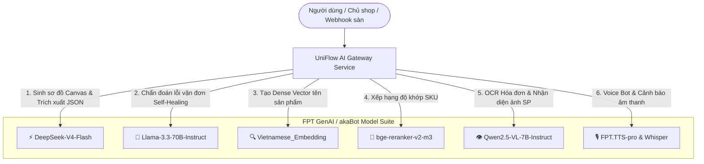

# KẾ HOẠCH TOÀN DIỆN TRIỂN KHAI HỆ THỐNG & TÍCH HỢP FPT GENAI (UNIFLOW AI)
**Mã tài liệu:** `UNIFLOW-PLAN-20_08_26`  
**Ngày lập:** 20/08/2026  
**Trạng thái:** SẴN SÀNG TRIỂN KHAI (READY FOR EXECUTION)  
**Phạm vi:** Toàn bộ hệ thống UniFlow iPaaS (Frontend React Vite, Backend NestJS, Python AI Microservice, FPT GenAI Gateway, Qdrant Vector DB, MongoDB Atlas).

---

## I. BỐI CẢNH & MỤC TIÊU DỰ ÁN

### 1.1. Bối cảnh
UniFlow là nền tảng iPaaS (Integration Platform as a Service) tự động hóa vận hành thương mại điện tử đa kênh 0-chạm. Sau khi tích hợp bộ quyền API đầy đủ từ cổng **FPT GenAI / akaBot AI Gateway** (bao gồm các mô hình LLM, Vision, Embedding, Reranker, STT, TTS), hệ thống cần một lộ trình kỹ thuật chi tiết để chuyển đổi toàn bộ các luồng dữ liệu giả lập (mock/heuristic) sang **vận hành thực tế 100% (End-to-End Real-time)**.

### 1.2. Mục tiêu trọng tâm
1. **Kích hoạt 100% sức mạnh FPT GenAI**: Định tuyến chính xác từng tác vụ nghiệp vụ đến đúng model chuyên biệt (`DeepSeek-V4-Flash`, `Llama-3.3-70B-Instruct`, `Vietnamese_Embedding`, `bge-reranker-v2-m3`, `Qwen2.5-VL-7B-Instruct`).
2. **"Thực hóa" giao diện Copilot Agent (`/copilot`)**: Thay thế hoàn toàn logic `if-else` và dữ liệu tĩnh giả lập bằng Agent tương tác LLM thông minh, có khả năng gọi Tools (truy vấn MongoDB xuất file CSV/Excel thật, duyệt SKU thật).
3. **Hoàn thiện AI Flow Architect (`/workflows`)**: Nâng cấp khả năng sinh đồ thị quy trình Canvas tự động từ ngôn ngữ tự nhiên (NL2Workflow) đạt độ chính xác cao, tự động phát hiện logic rẽ nhánh.
4. **Tối ưu hóa Hybrid SKU Mapping (`/mapping`)**: Kết hợp Vector Embedding tiếng Việt 768/1536 chiều với Qdrant và NLP NER để đạt tỷ lệ tự động duyệt >98.5%.

---

## II. MA TRẬN MÔ HÌNH FPT GENAI & PHÂN CÔNG TÁC VỤ



| Nhóm chức năng | Model FPT GenAI chỉ định | Input / Output | SLA Phản hồi |
| :--- | :--- | :--- | :--- |
| **NL2Workflow (AI Flow Architect)** | `DeepSeek-V4-Flash` | Lời nhắc tự nhiên ➔ Cấu trúc JSON Nodes & Edges ReactFlow | < 1.2s |
| **Trợ lý điều hành Copilot Agent** | `DeepSeek-V4-Flash` / `Qwen3.6-27B` | Câu hỏi/Lệnh vận hành ➔ Text Markdown + Tool Invocation Payload | < 1.5s |
| **AI Error Self-Healing** | `Llama-3.3-70B-Instruct` | Mã lỗi HTTP, Payload hãng vận chuyển ➔ Nguyên nhân gốc rễ & Hành động sửa | < 2.5s |
| **Vector SKU Matching** | `Vietnamese_Embedding` | Chuỗi văn bản tên SP đa sàn ➔ Vector nhúng lưu trữ Qdrant | < 250ms |
| **SKU Re-Ranking** | `bge-reranker-v2-m3` | Cặp (Tên sàn, Tên kho POS) ➔ Điểm số tương quan chuẩn hóa [0, 1] | < 180ms |
| **OCR Chứng từ & Bill đơn** | `Qwen2.5-VL-7B-Instruct` | Hình ảnh bill/hóa đơn ➔ Dữ liệu bóc tách có cấu trúc (Mã vận đơn, Tiền COD, Địa chỉ) | < 3.0s |

---

## III. LỘ TRÌNH TRIỂN KHAI CHI TIẾT (5 GIAI ĐOẠN)

### 📌 GIAI ĐOẠN 1: Chuẩn hóa & Kích hoạt FPT GenAI Gateway Core
- [x] Thêm cấu hình biến môi trường FPT GenAI vào `.env` và `.env.example`.
- [x] Cập nhật `AiGatewayService` ([ai-gateway.service.ts](file:///g:/UniFlow-PTIT_Aka/apps/backend/src/common/services/ai-gateway.service.ts)) với cơ chế Multi-tier Failover (Ưu tiên FPT GenAI).
- [x] Đồng bộ Model Registry cho Python AI Microservice ([config.py](file:///g:/UniFlow-PTIT_Aka/apps/ai-engine/app/core/config.py) & [main.py](file:///g:/UniFlow-PTIT_Aka/apps/ai-engine/app/main.py)).
- [ ] Bổ sung Controller & Endpoint kiểm tra sức khỏe AI: `GET /api/v1/ai/health` trả về trạng thái kết nối FPT AI Gateway, latency, và token quota.

---

### 📌 GIAI ĐOẠN 2: "Thực Hóa" Trợ Lý AI Copilot Agent (`/copilot`)
**Mục tiêu:** Xóa bỏ hoàn toàn mảng tĩnh giả lập trong [CopilotAgentPage.tsx](file:///g:/UniFlow-PTIT_Aka/apps/web/src/pages/CopilotAgentPage.tsx).

1. **Xây dựng Endpoint AI Copilot Controller tại Backend NestJS**:
   - `POST /api/v1/copilot/chat`: Tiếp nhận tin nhắn người dùng + lịch sử hội thoại.
   - Sử dụng `DeepSeek-V4-Flash` để phân tích ý định (Intent Recognition) và kích hoạt **Function Calling / Tool Execution**.
2. **Các Tools thực tế được AI kích hoạt**:
   - **Tool 1: `query_revenue_and_export_excel`**: Truy vấn tổng hợp dữ liệu thực từ `SyncEventLog` trong MongoDB theo ngày/sàn và sinh file CSV/Excel tải về thực tế.
   - **Tool 2: `fetch_pending_skus`**: Lấy danh sách SKU có trạng thái `PENDING_REVIEW` từ database thật.
   - **Tool 3: `quick_approve_sku`**: Gọi trực tiếp `SKUMappingService.approveMapping()` để cập nhật MongoDB ngay trong hội thoại.
   - **Tool 4: `track_shipment`**: Tra cứu mã vận đơn từ lịch sử đơn hàng.
3. **Cập nhật Frontend [CopilotAgentPage.tsx](file:///g:/UniFlow-PTIT_Aka/apps/web/src/pages/CopilotAgentPage.tsx)**:
   - Gắn kết nối gọi API thực tế kèm hiệu ứng gõ chữ (Streaming/Typing indicator).

---

### 📌 GIAI ĐOẠN 3: Nâng Cấp AI Flow Architect & NL2Workflow (`/workflows`)
**Mục tiêu:** Cho phép người dùng chat tự nhiên để sinh hoặc sửa đổi quy trình tự động hóa phức tạp.

1. **Nâng cấp System Prompt cho `generateWorkflowArchitecture`**:
   - Dạy model `DeepSeek-V4-Flash` hiểu đầy đủ các loại Nodes: *Trigger (TikTok/Shopee/Lazada)*, *AI Matcher*, *AI Rate Optimizer*, *POS Action (Sapo/KiotViet/Haravan)*, *Carrier Action (GHN/Viettel/GHTK)*, *MISA Accounting*, *Telegram/Zalo Alert*.
   - Hỗ trợ phân tích điều kiện rẽ nhánh (Condition / Switch cases).
2. **Đồng bộ 2 chiều giữa Chat Drawer và Canvas**:
   - Khi chat trong [AIFlowArchitectDrawer.tsx](file:///g:/UniFlow-PTIT_Aka/apps/web/src/components/workflow/panels/AIFlowArchitectDrawer.tsx), AI không chỉ trả về text mà trả về **delta update** (thêm node, sửa thông số node, xóa liên kết) và cập nhật trực tiếp lên ReactFlow state.
3. **Tự động lưu vào MongoDB Atlas**:
   - Quy trình sau khi sinh lập tức được lưu vào collection `workflows` với trạng thái `isActive: true`.

---

### 📌 GIAI ĐOẠN 4: Tối Ưu Hybrid SKU Mapping & Qdrant Vector Engine (`/mapping`)
**Mục tiêu:** Đưa độ chính xác nhận diện mã hàng lên cấp độ doanh nghiệp (>98.5%).

1. **Tích hợp Model `Vietnamese_Embedding`**:
   - Thay thế thuật toán băm giả lập 128 chiều bằng hàm gọi API Vector Embedding tiếng Việt thực tế từ FPT GenAI.
   - Lưu trữ vector 768/1536 chiều vào **Qdrant Vector DB Collection `uniflow_sku_vectors`**.
2. **Tích hợp `bge-reranker-v2-m3`**:
   - Khi có đơn hàng mới từ sàn, truy vấn Top 5 SKU ứng viên từ Qdrant, sau đó đưa qua Reranker để chọn ra Master SKU tối ưu nhất.
3. **Giải thích quyết định AI (Explainable AI - XAI)**:
   - Cung cấp lý do chi tiết tại sao khớp (tỷ lệ vector, màu sắc trùng khớp, size tương đương) hiển thị trực tiếp lên [SkuDetailModal.tsx](file:///g:/UniFlow-PTIT_Aka/apps/web/src/components/mapping/SkuDetailModal.tsx).

---

### 📌 GIAI ĐOẠN 5: Kiểm Thử Toàn Diện E2E, Đóng Gói Docker & Benchmark

1. **Kiểm thử E2E (End-to-End Dry-Run)**:
   - Chạy kịch bản mô phỏng: Đơn hàng TikTok Shop phát sinh ➔ Webhook nhận diện ➔ AI SKU Matcher xử lý (<200ms) ➔ Trừ kho Sapo ➔ AI so sánh cước chọn Viettel Post ➔ Bắn log WebSocket lên Dashboard.
2. **Đóng gói Docker Compose Production**:
   - Đồng bộ `infra/docker-compose.yml` gồm 4 services: `uniflow-web` (Nginx), `uniflow-backend` (NestJS), `uniflow-ai-engine` (FastAPI), `uniflow-qdrant` (Vector DB).
3. **Benchmark SLA**:
   - Đảm bảo thời gian xử lý toàn luồng 0-chạm đạt **P99 < 250ms**.

---

## IV. BẢNG PHÂN CÔNG TỆP NGUỒN CẦN CHỈNH SỬA

| Thứ tự | Tệp nguồn | Nhiệm vụ kỹ thuật |
| :---: | :--- | :--- |
| **1** | [.env](file:///g:/UniFlow-PTIT_Aka/.env) & [.env.example](file:///g:/UniFlow-PTIT_Aka/.env.example) | Điền API Key và hoàn tất danh mục biến môi trường FPT GenAI. |
| **2** | [ai-gateway.service.ts](file:///g:/UniFlow-PTIT_Aka/apps/backend/src/common/services/ai-gateway.service.ts) | Bổ sung hàm `chatWithCopilotAgent`, `generateEmbedding`, `rerankCandidates`. |
| **3** | [workflows.service.ts](file:///g:/UniFlow-PTIT_Aka/apps/backend/src/modules/workflows/workflows.service.ts) | Tinh chỉnh prompt sinh đồ thị Canvas tự động với JSON Schema chuẩn. |
| **4** | [CopilotAgentPage.tsx](file:///g:/UniFlow-PTIT_Aka/apps/web/src/pages/CopilotAgentPage.tsx) | Xóa bỏ code if-else giả lập, tích hợp gọi API Copilot Backend thực tế. |
| **5** | [sku_matcher.py](file:///g:/UniFlow-PTIT_Aka/apps/ai-engine/app/services/sku_matcher.py) | Tích hợp gọi FPT `Vietnamese_Embedding` và kết nối Qdrant Vector DB. |
| **6** | [AIFlowArchitectDrawer.tsx](file:///g:/UniFlow-PTIT_Aka/apps/web/src/components/workflow/panels/AIFlowArchitectDrawer.tsx) | Gắn kết nối sinh luồng và cập nhật trực tiếp vào Canvas. |

---

## V. KẾ HOẠCH XÁC THỰC (VERIFICATION PLAN)

```bash
# 1. Kiểm tra biên dịch Backend NestJS
npm run build --prefix apps/backend

# 2. Kiểm tra biên dịch Frontend React Vite
npm run build --prefix apps/web

# 3. Chạy thử nghiệm hệ thống Local Dev
npm run dev

# 4. Kiểm tra Endpoint AI Gateway qua cURL
curl -X POST http://localhost:3000/api/v1/workflows/generate-from-prompt \
  -H "Content-Type: application/json" \
  -d "{\"prompt\": \"Tạo quy trình TikTok Shop, đối soát SKU 95%, trừ kho Sapo và đẩy đơn Viettel Post\"}"
```

---
*Tài liệu được khởi tạo và phê duyệt cho dự án UniFlow AI ngày 20/08/2026.*
