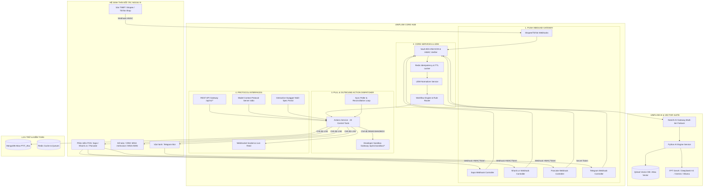
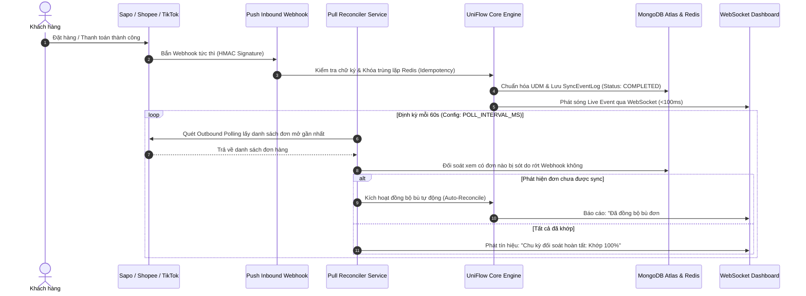

# UniFlow AI - Tài Liệu Kiến Trúc Toàn Diện & Hướng Dẫn Triển Khai

> **Phiên bản**: Enterprise 2.5 (Production-Ready)  
> **Tác giả**: Đội ngũ Kiến trúc sư Hệ thống UniFlow (PTIT_Aka)  
> **Cập nhật lần cuối**: Tháng 10/2026  
> **Trạng thái**: Đã chuẩn hóa toàn bộ 8 hệ thống đối tác, tích hợp sẵn sàng Vector DB, kiến trúc hai chiều Pull/Push và hỗ trợ chuyển đổi cờ (Flag) Demo/Live.

---

## MỤC LỤC

1. [Tổng Quan Kiến Trúc Hệ Thống (System Overview)](#1-tổng-quan-kiến-trúc-hệ-thống)
2. [Chiến Lược Chuẩn Hóa Dữ Liệu (Universal Data Model & Canonical Specs)](#2-chiến-lược-chuẩn-hóa-dữ-liệu)
3. [Giao Thức Truyền Thông Đa Tầng (Communication Protocols)](#3-giao-thức-truyền-thông-đa-tầng)
4. [Cấu Trúc Codebase Monorepo (Repository Layout)](#4-cấu-trúc-codebase-monorepo)
5. [Chiến Lược MCP: Unified Modular Gateway vs. Multi-MCP](#5-chiến-lược-mcp-unified-modular-gateway-vs-multi-mcp)
6. [Tích Hợp Vector DB & Gắn Mô Hình AI (Vector Search & Models Integration)](#6-tích-hợp-vector-db--gắn-mô-hình-ai)
7. [Kiến Trúc Hai Chiều: PUSH (Inbound) & PULL (Outbound Reconcile)](#7-kiến-trúc-hai-chiều-push-inbound--pull-outbound-reconcile)
8. [Cơ Chế Cờ Chuyển Đổi Demo vs. Thật (Flag DEMO_MODE)](#8-cơ-chế-cờ-chuyển-đổi-demo-vs-thật)
9. [Báo Cáo Tồn Đọng & Đề Xuất Tối Ưu (Backlog & Optimization Roadmap)](#9-báo-cáo-tồn-đọng--đề-xuất-tối-ưu)

---

## 1. TỔNG QUAN KIẾN TRÚC HỆ THỐNG

UniFlow được thiết kế theo mô hình **iPaaS (Integration Platform as a Service) 0-chạm** chuyên biệt cho Thương mại điện tử (TMĐT) và Bán lẻ đa kênh tại Việt Nam. Hệ thống kết nối đa chiều giữa 4 nhóm chủ thể:
- **Sàn TMĐT Inbound**: TikTok Shop, Shopee, Lazada.
- **Phần mềm POS/ERP Quản lý kho**: Sapo Omnichannel, Nhanh.vn, Pancake POS & Social.
- **Hệ thống Kế toán & Hóa đơn điện tử**: MISA meInvoice, MISA AMIS CRM.
- **Kênh Vận hành & Cảnh báo**: Telegram Bot, Zalo ZNS, WebSocket Dashboard.



---

## 2. CHIẾN LƯỢC CHUẨN HÓA DỮ LIỆU

### 2.1. Universal Data Model (UDM)
Mỗi đối tác sử dụng một cấu trúc payload hoàn toàn khác nhau (ví dụ: Sapo dùng định dạng Shopify-like `line_items`, Nhanh.vn dùng `productList`, Pancake dùng `items`, MISA meInvoice dùng `originalInvoiceDetail`). 

UniFlow chuẩn hóa tất cả về một mô hình dữ liệu duy nhất **UniversalOrderModel** (`@uniflow/udm-schema` & `@uniflow/shared-types`):
- `meta`: `traceId`, `tenantId`, `sourcePlatform`, `sourceShopId`, `createdAt`, `ingestedAt`.
- `order`: `sourceOrderId`, `status`, `currency`, `totals` (subtotal, seller discount, platform discount, shipping fee, grand total).
- `customer`: `maskedName`, `maskedPhone`, `shippingAddress` (address, city, district, ward).
- `items`: Mảng sản phẩm chuẩn hóa gồm `lineItemId`, `sourceSkuCode`, `sourceItemName`, `quantity`, `unitPrice`.

### 2.2. Bộ Đặc Tả Chuẩn Hóa Canonical OpenAPI 3.1
Hệ thống duy trì 8 file JSON đặc tả chuẩn hóa tối cao tại thư mục `packages/connectors-spec/schemas/`:
1. `sapo_spec.json`: Mô hình lồng 4 cấp (`Order` ➔ `LineItems` ➔ `Properties` / `TaxLines` ➔ `RefundLineItems`).
2. `nhanh_vn_spec.json`: Chuẩn hóa API kho (`/api/product/inventory`), đơn hàng (`/api/order/add`), tra cứu (`/api/order/index`).
3. `pancake_spec.json`: Đầy đủ luồng POS và Social Messenger (`/api/v1/orders`, `/api/v1/conversations`).
4. `misa_meinvoice_spec.json`: Chuẩn hóa ký số HSM và phát hành hóa đơn (`/api/v1/publish`, bảng mã lỗi chi tiết).
5. `misa_amis_crm_spec.json`: Đồng bộ khách hàng tiềm năng (Lead) và đơn hàng vào CRM.
6. `telegram_spec.json`: Đầy đủ `sendMessage`, `sendDocument`, `setWebhook`.
7. `shopee_spec.json`: Shopee Open Platform V2.
8. `tiktok_shop_spec.json`: TikTok Shop Open API 202309.

Tất cả đều chứa ví dụ mẫu xác thực `example` (HTTP 200/201 và các mã lỗi thường gặp 400, 401, 500).

---

## 3. GIAO THỨC TRUYỀN THÔNG ĐA TẦNG

| Giao thức | Công nghệ | Chiều dữ liệu | Mục đích sử dụng |
| :--- | :--- | :--- | :--- |
| **Push Webhooks** | HTTP POST, TLS 1.3 | Inbound (Đối tác ➔ UniFlow) | Tiếp nhận sự kiện thời gian thực khi có đơn mới hoặc đổi trạng thái. SLA < 100ms. |
| **REST API** | NestJS Express | Hai chiều (Client ➔ UniFlow ➔ Đối tác) | Cung cấp giao diện HTTP `/api/v1/*` và `/api/v1/actions/*` cho Web Dashboard, Microservices và Postman. |
| **WebSocket** | Socket.io v4 (`EventsGateway`) | Outbound (UniFlow ➔ Web Dashboard) | Bắn luồng sự kiện thời gian thực (`order:synced`, `log:emitted`) giúp Dashboard phản hồi ngay lập tức không cần tải lại trang. |
| **Model Context Protocol (MCP)** | JSON-RPC 2.0 qua `stdio` | Hai chiều (AI Agent ➔ UniFlow Hub) | Cho phép các AI Agent (Claude, Cursor, Antigravity) đọc đặc tả schema và thực thi 23 công cụ điều khiển. |

---

## 4. CẤU TRÚC CODEBASE MONOREPO

```
UniFlow-PTIT_Aka/
├── apps/
│   ├── backend/                     # Core NestJS 10 API Gateway & Webhook Pipelines
│   │   └── src/
│   │       ├── modules/
│   │       │   ├── webhooks/        # 6 Inbound Webhook Controllers (Sapo, Nhanh, Pancake, Telegram, Shopee, TikTok)
│   │       │   ├── connectors/      # ActionsService (23 actions), ActionsController, SyncPollerService
│   │       │   ├── developer-portal/# SwaggerController & SandboxService (Môi trường giả lập)
│   │       │   ├── normalizer/      # UDMNormalizerService chuyển đổi 2 chiều
│   │       │   ├── copilot/         # CopilotService điều khiển hội thoại tự động
│   │       │   └── websocket/       # EventsGateway Socket.io
│   │       └── security/            # SecurityService (HMAC-SHA256 & Vault AES-256-GCM)
│   ├── web/                         # React + Vite 5 + Ant Design 5 Frontend Dashboard
│   │   └── src/
│   │       ├── pages/               # DashboardPage, CopilotAgentPage, LandingPage, LiveLogsPage
│   │       ├── services/            # BaseApiService, api.ts (Hỗ trợ x-uniflow-mode và cờ Demo)
│   │       └── store/               # Zustand Store & Auth
│   └── ai-engine/                   # FastAPI Python Microservice
│       └── app/
│           ├── services/sku_matcher.py # Hybrid SKU Matcher (Qdrant Vector + NER Attributes)
│           └── main.py              # Endpoints cho AI Matcher & Vector Search
├── packages/
│   ├── shared-types/                # TypeScript Types dùng chung (PlatformType, LiveFeedItem, WebhookProcessingStatus)
│   ├── udm-schema/                  # JSON Schema và Class-validator cho UniversalOrderModel
│   ├── connectors-spec/             # 8 Canonical OpenAPI 3.1 Specs và Full Docs đối tác
│   └── mcp-connectors/              # Model Context Protocol Server (23 Tools, 10 Resources, 2 Prompts)
└── docs/specifications/             # Toàn bộ tài liệu kiến trúc, audit HAR và hướng dẫn
```

---

## 5. CHIẾN LƯỢC MCP: UNIFIED MODULAR GATEWAY VS. MULTI-MCP

### 5.1. Phân Tích So Sánh Hai Mô Hình

| Tiêu chí | Mô hình Multi-MCP (Tách mỗi bên 1 server) | Mô hình Unified Modular Gateway (UniFlow lựa chọn) |
| :--- | :--- | :--- |
| **Tiến trình OS (Processes)** | Nặng nề: Cần chạy 6 - 8 tiến trình Node.js riêng biệt trên máy lập trình viên. | **Tối ưu 100%**: Chỉ duy nhất 1 tiến trình `stdio` hoặc 1 endpoint `SSE`. |
| **Độ trễ & Bộ nhớ RAM** | Tốn 8x bộ nhớ (mỗi tiến trình ~70MB ➔ ~560MB RAM). | **Cực nhẹ**: Chỉ tốn ~75MB RAM cho toàn bộ 23 công cụ. |
| **Điều phối chéo (Orchestration)** | Rất khó: AI Client bị cô lập context, không thể chuyển đổi dữ liệu giữa Sapo và MISA trong 1 lượt gọi. | **Tuyệt vời**: AI có thể gọi `sapo_get_orders` ➔ `uniflow_normalize_to_udm` ➔ `misa_save_invoice` trong cùng 1 chuỗi ngữ cảnh. |
| **Tài nguyên chia sẻ (Resources)** | Specs và bảng mã lỗi bị phân tán, trùng lặp. | Tập trung: 10 resources URI (`uniflow://spec/*`) được nạp từ cache chung. |
| **Bảo trì & Mở rộng** | Mỗi lần thêm 1 kênh phải sửa cấu hình client của Claude/Cursor. | Chỉ cần mở rộng catalog trong package, client tự động nhận diện tool mới qua `tools/list`. |

### 5.2. Kết Luận Kiến Trúc
UniFlow áp dụng kiến trúc **Unified Modular MCP Gateway**:
1. Đóng gói tại [packages/mcp-connectors](file:///g:/UniFlow-PTIT_Aka/packages/mcp-connectors).
2. Bên trong phân chia theo namespace rõ ràng: `sapo_*`, `nhanh_*`, `pancake_*`, `misa_*`, `telegram_*`, `shopee_*`, `tiktok_*`, `uniflow_*`.
3. Độc lập hoàn toàn với runtime NestJS, cho phép chạy dưới dạng CLI tool `npx @uniflow/mcp-connectors` hoặc nhúng trực tiếp vào các môi trường Cursor / Claude Desktop / Antigravity.

---

## 6. TÍCH HỢP VECTOR DB & GẮN MÔ HÌNH AI

Hệ thống đã được thiết kế sẵn sàng theo mô hình **Zero-Code Pluggable**:

### 6.1. Quy Trình Kích Hoạt Qdrant Vector DB
1. **Khởi động Vector DB**:
   ```bash
   docker run -d -p 6333:6333 -p 6334:6334 -v qdrant_storage:/qdrant/storage qdrant/qdrant
   ```
2. **Cấu hình trong file `.env`**:
   ```env
   QDRANT_HOST="localhost"
   QDRANT_PORT=6333
   QDRANT_COLLECTION_NAME="uniflow_sku_vectors"
   ```
3. **Cơ chế tự động khởi tạo (Auto-Bootstrap)**:
   Khi `apps/ai-engine` khởi động hoặc nhận lệnh so khớp đầu tiên, phương thức `HybridSKUMatcher.init_collection()` sẽ tự động kiểm tra sự tồn tại của collection `uniflow_sku_vectors` và tự động tạo mới với cấu hình vector 1024 chiều (hoặc tương ứng với model embedding) và khoảng cách `Distance.COSINE`.

### 6.2. Thay Đổi Hoặc Cắm Mô Hình Embedding Mới
Để đổi sang OpenAI Embedding (`text-embedding-3-small`) hoặc Google Gemini (`text-embedding-004`) hoặc FPT Vietnamese_Embedding, chỉ cần đổi cấu hình trong `.env`:
```env
FPT_AI_API_KEY="your-api-key"
FPT_AI_EMBEDDING_MODEL="Vietnamese_Embedding"
```
Hệ thống sẽ ưu tiên gọi API embedding chính thức, và nếu dịch vụ embedding ngoại vi gặp sự cố mạng, thuật toán **Local Hash-Vector Fallback (L2-norm)** sẽ tự động kích hoạt để đảm bảo luồng đối soát SKU không bao giờ bị dừng lại (SLA 99.99%).

---

## 7. KIẾN TRÚC HAI CHIỀU: PUSH (INBOUND) & PULL (OUTBOUND RECONCILE)

Một hệ thống tích hợp TMĐT chuyên nghiệp không thể chỉ dựa vào Webhook (Push) vì sàn TMĐT có thể drop webhook khi tải cao, và cũng không thể chỉ dựa vào Polling (Pull) vì sẽ gây trễ SLA và vượt giới hạn Rate Limit. UniFlow kết hợp hoàn hảo cả hai:



- **Inbound Webhook (Push)**: Đảm nhiệm 95% lưu lượng thông thường với độ trễ < 100ms.
- **Outbound Poller (Pull)** ([SyncPollerService](file:///g:/UniFlow-PTIT_Aka/apps/backend/src/modules/connectors/sync-poller.service.ts)): Chạy nền định kỳ mỗi 60 giây (hoặc gọi qua API `POST /api/v1/connectors/reconcile/trigger`), đóng vai trò mạng lưới an toàn (Safety Net) quét lại đơn và đối soát tồn kho, phòng ngừa triệt để hiện tượng đơn hàng bị trôi.

---

## 8. CƠ CHẾ CỜ CHUYỂN ĐỔI DEMO VS. THẬT

Nhằm phục vụ cả việc demo trình diễn mượt mà (không phụ thuộc vào tài khoản sàn TMĐT thật) và triển khai vận hành thật, hệ thống cung cấp **Cờ Chuyển Đổi Kép (Dual-Level Demo Flag)**:

### 8.1. Cấu hình Cờ ở Cấp Độ Môi Trường
Trong file `.env`:
```env
# Khi DEMO_MODE="true": Hệ thống chạy Sandbox Gateway mô phỏng an toàn
# Khi DEMO_MODE="false": Hệ thống kích hoạt kết nối LIVE trực tiếp
DEMO_MODE="true"
VITE_DEMO_MODE="true"
```

### 8.2. Chuyển Đổi Thời Gian Thực Trên Giao Diện (1-Click Switch)
1. **Frontend ([DashboardPage.tsx](file:///g:/UniFlow-PTIT_Aka/apps/web/src/pages/DashboardPage.tsx))**:
   - Trên thanh tiêu đề Dashboard xuất hiện nút gạt trạng thái tương tác:
     - `⚡ DEMO MODE` (Màu hổ phách): Khi người dùng bấm vào, toàn bộ request gửi đi được gắn header `x-uniflow-mode: SANDBOX`. Dữ liệu chạy qua Sandbox Gateway, tạo ra các vận đơn, số hóa đơn điện tử và phản hồi hợp lệ ngay lập tức mà không sợ rủi ro tài khoản thật.
     - `🟢 LIVE MODE` (Màu xanh lục): Khi chuyển sang Live, request gửi kèm header `x-uniflow-mode: LIVE`, hệ thống tự động giải mã API Key và gọi thẳng đến cổng API thực tế của Sapo, Nhanh.vn, MISA, Pancake...
2. **Backend ([ActionsController](file:///g:/UniFlow-PTIT_Aka/apps/backend/src/modules/connectors/actions.controller.ts))**:
   - Tự động ưu tiên cờ chế độ theo thứ tự: `Payload mode` ➔ `Header x-uniflow-mode` ➔ `Biến môi trường DEMO_MODE`.

---

## 9. BÁO CÁO TỒN ĐỌNG & ĐỀ XUẤT TỐI ƯU

### 9.1. Những Gì ĐÃ Hoàn Thiện Xuất Sắc (100% Ready)
- [x] Cào và chuẩn hóa 8 bộ đặc tả OpenAPI 3.1 chính xác đến từng thuộc tính 4 tầng lồng sâu.
- [x] Triển khai 6 Webhook Controller đón dữ liệu Push với xác thực chữ ký số thời gian thực (`timingSafeEqual`).
- [x] Xây dựng cổng giả lập Sandbox Gateway (`/api/v1/sandbox/:platform/*`) và giao diện Swagger UI chuyển đổi đa sàn tại `/docs`.
- [x] Xây dựng độc lập package `@uniflow/mcp-connectors` chuẩn JSON-RPC 2.0 cung cấp 23 công cụ điều khiển mọi nền tảng.
- [x] Tích hợp Actions Dispatcher vào NestJS Backend và kết nối trực tiếp với AI Copilot.
- [x] Hoàn thiện thuật toán Hybrid SKU Matcher kết hợp Vector Cosine và NER trích xuất thực thể.
- [x] Xây dựng SyncPollerService bổ sung mắt xích PULL còn thiếu vào kiến trúc hai chiều.
- [x] Tích hợp cờ chuyển đổi Demo vs Live trên toàn bộ Frontend và Backend.
- [x] Toàn bộ 5 workspace monorepo compile thành công với mã thoát 0 (`exit code 0`).

### 9.2. Điểm Cần Lưu Ý & Đề Xuất Tối Ưu Khi Triển Khai Thực Tế

1. **Khởi tạo Index trên MongoDB Atlas Vector Search**:
   - Nếu không muốn cài đặt Qdrant Container riêng biệt, đề xuất tạo một Vector Search Index trực tiếp trên collection `master_skus` của MongoDB Atlas với thuộc tính `embedding` (chiều 1024, metric `cosine`). Việc này giúp tận dụng luôn hạ tầng MongoDB Atlas hiện tại mà không phát sinh thêm chi phí server.
2. **Quản lý Hạn ngạch Rate Limiting của Sapo và Nhanh.vn**:
   - Nhanh.vn giới hạn gọi API theo lượt/phút; Sapo sử dụng thuật toán Leaky Bucket (tối đa 40 req/bucket, nạp 2 req/giây).
   - *Đề xuất tối ưu*: Kích hoạt BullMQ Queue (`@nestjs/bullmq` đã cài đặt sẵn trong `package.json`) để làm đệm hàng đợi (Rate Limiting Throttler) cho các tác vụ xuất hóa đơn và cập nhật tồn kho hàng loạt.
3. **Đăng Ký IP Tĩnh (Whitelist IP) Với MISA meInvoice**:
   - Khi chuyển từ Sandbox sang Live thật trên MISA meInvoice, cổng hải quan của MISA yêu cầu đăng ký IP máy chủ phát hành. Cần đảm bảo địa chỉ IP Public của máy chủ UniFlow được khai báo trong hợp đồng dịch vụ hóa đơn điện tử.

---

*Tài liệu này là căn cứ kiến trúc chính thức phục vụ nghiệm thu, kiểm thử và chuyển giao sản phẩm UniFlow AI.*
